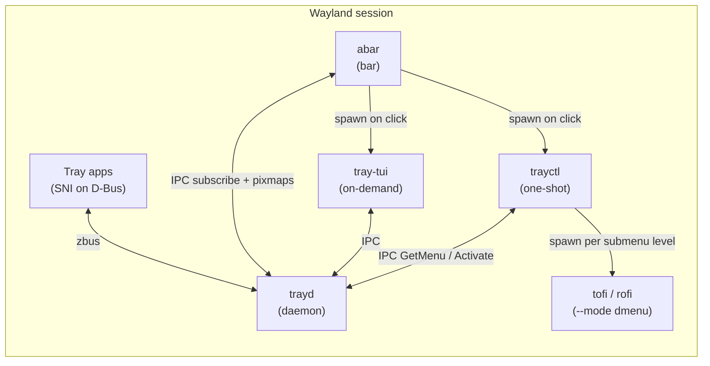

# trayd — Rust architecture + implementation plan

This document is the **human roadmap** and **agent playbook** for **trayd**: a minimal **Wayland-session** system-tray **daemon** and **standardized IPC** surface for bars, launchers, and terminal clients.

It mirrors the execution discipline of [`docs/ABAR_PLAN.md`](ABAR_PLAN.md) (abar) and `wau/docs/WAU_RS_PLAN.md`:

- Library-first crate split, small verifiable phases, strict quality gates (fmt, clippy `-D warnings` with feature matrix, tests, `cargo doc`, `typos`, `cargo deny`).
- **Directory modules** with **sibling `tests.rs`** — tests never live in the same file as logic.
- **Per-integration Cargo features** where optional surfaces would otherwise bitrot CI.

**Design authority (layered, newest wins on conflicts):**

| Source                                                                                               | Role                                                                                     |
| ---------------------------------------------------------------------------------------------------- | ---------------------------------------------------------------------------------------- |
| [trayd PR #1 comment (final spec)](https://github.com/Gigas002/trayd/pull/1#issuecomment-4493847614) | **Canonical** component split, IPC commands, submenu loop, **no daemon spawning**        |
| [abar issue #7 — feature: tray](https://github.com/Gigas002/abar/issues/7)                           | Original motivation, abar config shapes, tray display styles                             |
| [abar PR #9 — modules cleanup](https://github.com/Gigas002/abar/pull/9)                              | IPC + user scripts for modules; **abar spawns one-shot helpers** (same pattern for tray) |
| [tofi-rs PR #29 — dmenu](https://github.com/Gigas002/tofi-rs/pull/29)                                | `tofi --mode dmenu` stdin/stdout contract for **trayctl**                                |
| [trayd PR #1 (draft impl)](https://github.com/Gigas002/trayd/pull/1)                                 | Early IPC + D-Bus wiring — **to be recreated** on top of this plan (May 2026)            |

---

## 1. Goals, motivation, and constraints

### 1.1 Problem (from abar #7)

Tray support in minimal bars (`ashell`, `waybar`, **abar**) is hard to keep **small** and **correct**: StatusNotifierItem (SNI) hosting, D-Bus menu trees, pixmap lifecycles, and in-bar menus fight the “no heavyweight UI toolkit” rule.

**Decision:** extract tray into a dedicated daemon **`trayd`** so:

- One **D-Bus (`zbus`)** implementation is the **single source of truth** for tray state on the session.
- **abar** (and other bars) talk to **`trayd` via IPC only** — **no** `libtrayd` dependency in the bar.
- **Menus** are **not** drawn inside trayd or abar: a **one-shot orchestrator** (**`trayctl`**) or a **TUI** (**`tray-tui`**) talks to trayd over the same socket; **abar only spawns** the user-configured command on click (issue #7 + PR #9 pattern).
- **`trayd` never forks** launcher or consumer processes — stability and clear boundaries ([PR #1 spec](https://github.com/Gigas002/trayd/pull/1#issuecomment-4493847614)).

**References (read-only, not dependencies):**

- [system-tray](https://github.com/JakeStanger/system-tray) — protocol/event shape reference; **do not** depend on the crate.
- [tray-tui](https://github.com/Levizor/tray-tui) — TUI interaction patterns for **`tray-tui`**.

### 1.2 Goals

- **Minimal surface area**: smallest useful SNI host + IPC; no GTK/Qt/iced/winit in this repo.
- **Session D-Bus host**: **StatusNotifierWatcher** + **StatusNotifierItem** + **DBusMenu** via **`zbus` only** (no `libdbus` / `dbus-glib`).
- **Stable IPC**: documented v1 so **abar**, **trayctl**, **tray-tui**, and scripts interoperate via the **socket** — **no** shared Rust crates between consumers.
- **Wayland-native ecosystem**: trayd does not paint a bar; it feeds **metadata + pixmaps** to consumers. **abar** keeps Cairo+Pango rendering for tray icons.
- **Tokio** for async D-Bus and IPC I/O; **no blocking** the daemon on subprocess I/O.

### 1.3 Non-goals

- **No GUI** in trayd: no windows, popovers, GTK menus, or bar drawing.
- **No process spawning in trayd** — no `menu-dmenu`, no `Command::spawn`, no launcher awareness in the daemon.
- **No** dependency on [system-tray](https://github.com/JakeStanger/system-tray) (crate).
- **No** embedded dmenu/rofi/tofi UI inside trayd — **trayctl** owns the dmenu loop; **abar** only execs user config.
- **No** promise of full freedesktop tray parity on day one; grow in phases with explicit verify steps.
- **No** MPRIS, notifications, or power applets in trayd (abar handles MPRIS separately per [abar PR #9](https://github.com/Gigas002/abar/pull/9)).

### 1.4 System components (final spec)

All visualization clients are **peers** on the same Unix socket. None depend on each other.



| Component    | Role                                          | Lifecycle                            | Spawns processes?                                                    |
| ------------ | --------------------------------------------- | ------------------------------------ | -------------------------------------------------------------------- |
| **trayd**    | SNI watcher, icon/menu cache, **IPC server**  | Persistent daemon (`trayd run`)      | **Never**                                                            |
| **libtrayd** | D-Bus + in-memory `TrayHost` API              | Linked only by **trayd** binary      | N/A                                                                  |
| **abar**     | Bar UI; tray segments + pixmaps               | Persistent Wayland surface           | **Yes** — user `launcher` on menu click (e.g. `trayctl`, `tray-tui`) |
| **trayctl**  | IPC → stdin/stdout bridge for dmenu launchers | One-shot per bar click               | **Yes** — `tofi --mode dmenu`, `rofi -dmenu`, … per submenu level    |
| **tray-tui** | ratatui dashboard; menus inside terminal      | On-demand (terminal or abar-spawned) | **Never** external launchers                                         |

abar keeps a compile-time `tray` feature for **IPC client + render + spawn launcher**, not for hosting D-Bus.

**Relation to abar PR #9:** built-in modules (keyboard, workspace, window, audio, mpris) already use **IPC scripts** and **spawn helpers outside the bar**. Tray follows the same rule: abar stays thin; **trayctl** / **tray-tui** are separate binaries in PATH.

### 1.5 Definitions

- **Item / app_id**: one StatusNotifier registration (stable string id on the wire).
- **MinimalTrayItem**: snapshot fields for bar rendering (title, status, icon handle — see §3.2).
- **MenuItem**: one DBusMenu row (`label`, `item_id`, `is_submenu`).
- **submenu_id**: `None` = top-level menu; `Some(u32)` = nested folder ([PR #1 spec](https://github.com/Gigas002/trayd/pull/1#issuecomment-4493847614)).
- **Consumer**: any process using the **IPC socket** only — never `libtrayd` / `trayd` as libraries.

---

## 2. Repository layout (target)

Workspace members: **`libtrayd`**, **`trayd`**, **`trayctl`**, **`tray-tui`** (crate/binary name; replaces earlier **`trayd-client`** naming).

**abar** lives under `abar/` as a **sibling tree** for integration testing — not a workspace member.

```text
trayd/                           # workspace root
  Cargo.toml                     # members: libtrayd, trayd, trayctl, tray-tui
  deny.toml
  examples/
    trayd.toml                   # daemon: socket path, log level
    ipc-examples/                # golden NDJSON fixtures
  libtrayd/
    src/
      error.rs
      model/                     # ItemId, Pixmap, MenuNode, HostEvent
      dbus/                      # SNI watcher, item proxy, menu host
      host/                      # TrayHost
  trayd/
    src/
      main.rs
      ipc/                       # protocol, codec, server (daemon only)
      daemon/
      config/
      cli/                       # run, ping (debug); NOT menu-dmenu
  trayctl/
    src/
      main.rs
      ipc/                       # socket client (wire types per docs/IPC.md)
      dmenu/                     # submenu loop, spawn user dmenu cmd
      cli/
  tray-tui/
    src/
      main.rs
      ipc/
      app/                       # ratatui tree UI
      config/                    # $XDG_CONFIG_HOME/tray-tui/config.toml
  docs/
    PLAN.md
    IPC.md
```

### 2.1 Crate boundary rules

| Crate        | Responsibility                                     | Allowed deps                                                            | Forbidden                                                           |
| ------------ | -------------------------------------------------- | ----------------------------------------------------------------------- | ------------------------------------------------------------------- |
| **libtrayd** | `TrayHost`, SNI/DBusMenu, in-process types         | `zbus`, `tokio`, `tracing`, `thiserror`                                 | IPC, clap, subprocess spawn                                         |
| **trayd**    | Daemon + IPC **server**; wires `TrayHost` → socket | `libtrayd`, `tokio`, `serde_json`, `tracing-subscriber`, minimal `clap` | Spawning consumers/launchers; reimplementing D-Bus outside libtrayd |
| **trayctl**  | One-shot menu orchestration + dmenu I/O            | `tokio`/`std::process`, `serde_json`, `clap`                            | `libtrayd`, D-Bus, **persistent** daemon logic                      |
| **tray-tui** | Terminal tray UX                                   | `ratatui`, `crossterm`, `tokio`, `serde_json`                           | `libtrayd`, `trayd` crate, spawning rofi/tofi                       |

**All external consumers** duplicate serde wire types per **`docs/IPC.md`** — no shared IPC crate.

**Done (Phase 0):** `trayd-client` removed; **`tray-tui`** and **`trayctl`** crates wired in workspace + CI.

---

## 3. IPC protocol (standardized contract)

Authoritative command names from [PR #1 spec](https://github.com/Gigas002/trayd/pull/1#issuecomment-4493847614). Full wire schema in **`docs/IPC.md`** (Phase 1).

### 3.1 Transport

- **Unix domain socket**, default `$XDG_RUNTIME_DIR/trayd.sock` (overridable in `trayd.toml`).
- **NDJSON**, `"v": 1` on every request/response.
- **Serialization:** JSON for v1 (`serde_json`); bincode optional later — not required for v0.1.

### 3.2 Core commands (v1)

| Command     | Callers                          | Purpose                             | Response                                                                     |
| ----------- | -------------------------------- | ----------------------------------- | ---------------------------------------------------------------------------- |
| `ping`      | abar, trayctl, tray-tui, scripts | Health check                        | `pong`                                                                       |
| `subscribe` | abar, tray-tui                   | Persistent **event stream**         | `TrayEvent::Update(Vec<MinimalTrayItem>)` on register/unregister/icon change |
| `get_items` | trayctl, scripts                 | One-shot snapshot                   | `Vec<MinimalTrayItem>`                                                       |
| `get_menu`  | trayctl, tray-tui                | Menu layout for one app             | `{ app_id, submenu_id: Option<u32> }` → `Vec<MenuItem>`                      |
| `activate`  | trayctl, tray-tui                | Final menu choice or primary action | `{ app_id, item_id: u32 }` → `ack` (trayd forwards D-Bus activation)         |

**Extensions for abar icon rendering** (same v1, document in IPC.md):

| Command      | Callers | Purpose                                        |
| ------------ | ------- | ---------------------------------------------- |
| `get_pixmap` | abar    | `{ app_id, size }` → icon bytes for Cairo blit |
| `scroll`     | abar    | Wheel on tray item (optional v0.1)             |

**Removed from earlier drafts:** `menu_open` / `menu_select` / `menu_close` sessions on the daemon; **`trayd menu-dmenu`** CLI — replaced by **trayctl** stateless loop.

**Errors:** `{ "v":1, "error": { "code", "message" } }` — `NOT_FOUND`, `BUS_FAILED`, `INVALID_APP_ID`, …

### 3.3 trayctl submenu loop (dmenu path)

**abar** does not talk to tofi/rofi directly for tray menus. On click it runs the user’s **`[tray] launcher`** (typically **`trayctl`**).

**trayctl** (stateless, one process per bar click):

1. Parse args: `app_id`, optional `--dmenu-cmd` (default from env/config, e.g. `tofi --mode dmenu`).
2. Loop while the current choice is a submenu folder:
   - `get_menu { app_id, submenu_id }` → trayd
   - Pipe **labels** (one per line) to **stdin** of `dmenu-cmd`
   - Read **stdout** selection; Esc/empty → exit
   - If `is_submenu` → set `submenu_id`, continue loop
   - Else → `activate { app_id, item_id }` → exit

**tofi** ([tofi-rs#29](https://github.com/Gigas002/tofi-rs/pull/29)): use **`tofi --mode dmenu`** (stdin lines in, selected line on stdout). Legacy `tofi --dmenu` is not the target contract.

**rofi:** `rofi -dmenu` remains a valid `--dmenu-cmd` for trayctl.

### 3.4 tray-tui path

- Connects to the same socket; uses `subscribe`, `get_menu`, `activate`, `get_items`.
- Renders **all submenu levels inside ratatui** — **no** external dmenu spawns.
- Suitable for `launcher = "tray-tui"` or manual terminal use.

### 3.5 Why no shared Rust libraries for consumers

Per [abar #7](https://github.com/Gigas002/abar/issues/7): avoids version lock-in; bars stay minimal; trayd can be upgraded independently.

- **`libtrayd`**: linked **only** by **`trayd`**.
- **abar / trayctl / tray-tui**: socket clients only; implement NDJSON per **`docs/IPC.md`**.

### 3.6 trayd CLI scope (narrow)

| Command               | Role                                        |
| --------------------- | ------------------------------------------- |
| `trayd` / `trayd run` | Start D-Bus host + IPC server               |
| `trayd ping`          | Debug health (optional wrapper over socket) |

**Not in trayd:** `menu-dmenu`, `list` as the primary API (use socket `get_items` / `subscribe`), or any subprocess orchestration.

---

## 4. D-Bus host design (libtrayd)

Unchanged in spirit from the first draft; implementation follows [trayd PR #1](https://github.com/Gigas002/trayd/pull/1) once recreated.

- Register **org.kde.StatusNotifierWatcher** (and item interfaces used by target apps).
- **TrayHost**: in-memory cache of items + menu trees; events → IPC `subscribe` stream.
- **Pixmap policy:** cache by `(app_id, size)`; invalidate on icon signals.
- **Single daemon** per session: socket path + optional lockfile in **`trayd::daemon`** only.

**Headless / CI:** host state machine + menu diff unit tests; live bus tests `#[ignore]` with manual checklist.

---

## 5. Binaries

### 5.1 `trayd`

- Persistent daemon only.
- Config: `examples/trayd.toml` — socket path, log filter.
- **Systemd** user unit documented in Phase 7 (optional for v0.1).

### 5.2 `trayctl`

- **Transient** orchestrator; exit code reflects cancel vs activate.
- Flags (illustrative): `trayctl menu --app-id <id> --dmenu-cmd 'tofi --mode dmenu'`
- Optional `trayctl items` → print `get_items` for scripts.
- Spawns **only** the user-supplied dmenu command; never starts trayd.

### 5.3 `tray-tui`

- ratatui UI; config `$XDG_CONFIG_HOME/tray-tui/config.toml`.
- Default socket: `$XDG_RUNTIME_DIR/trayd.sock`.
- Inspired by [tray-tui](https://github.com/Levizor/tray-tui); **no** dependency on that crate.

---

## 6. abar integration (consumer spec — abar repo)

### 6.1 Config (issue #7, updated launchers)

`config.toml`:

```toml
[tray]
# GUI dmenu path (abar spawns this on menu click; trayd stays unaware)
launcher = "trayctl menu --dmenu-cmd 'tofi --mode dmenu'"

# Terminal-native tray (abar may wrap with $TERMINAL per PR #9 spawn rules)
# launcher = "tray-tui"
```

`theme.toml`:

```toml
[tray]
# icons | submenu | simple
style = "icons"
```

| `style`   | abar behavior                                                                                          |
| --------- | ------------------------------------------------------------------------------------------------------ |
| `icons`   | One segment per item; `get_pixmap` + `subscribe`; click → `activate` or spawn `launcher` with `app_id` |
| `submenu` | Single “tray” segment; click → `launcher` listing items (`trayctl` / tray-tui)                         |
| `simple`  | Label `tray: N`; click → `launcher`                                                                    |

The old `dmenu = true` flag collapses into **which launcher string** the user sets (trayctl vs tray-tui).

### 6.2 abar runtime flow

1. **Startup:** `trayd ping` over socket → else spawn `trayd run` or warn (config-dependent).
2. **Background task:** persistent `subscribe` socket → update tray snapshot → repaint Wayland surface (same pattern as other IPC modules post–[PR #9](https://github.com/Gigas002/abar/pull/9)).
3. **Render:** `MinimalTrayItem` + `get_pixmap` → segments / icons.
4. **Input:** hit-test → primary `activate` on icon, or **`std::process::Command`** to run `[tray] launcher` with `app_id` (and `$TERMINAL` when launcher is TUI — same as calendar/mpris spawn fixes in PR #9).
5. **No** `libtrayd` in `abar/Cargo.toml`.

### 6.3 Cross-repo checklist

- [ ] trayd + trayctl + tray-tui shipped (this repo).
- [ ] abar `tray` feature: IPC subscribe + pixmap + spawn `launcher` only.
- [ ] Document: trayd in PATH; optional `trayd.service` user unit.

---

## 7. Quality gates (mirror abar §7)

When a phase is marked complete:

- `cargo fmt --check`
- `typos`
- `cargo deny check`
- `cargo clippy --workspace --all-targets --no-default-features -- -D warnings`
- `cargo clippy --workspace --all-targets --all-features -- -D warnings`
- `cargo test --workspace --no-default-features`
- `cargo test --workspace --all-features`
- `cargo doc --workspace --no-deps`

**CI:** trayd workspace jobs must **not** install Cairo/Pango (abar subtree only when testing integration locally).

---

## 8. Phased steps

### Phase 0 — Workspace scaffold + hygiene

- [x] Crates `libtrayd`, `trayd`, `trayctl`, `tray-tui` (stubs).
- [x] Workspace metadata, `deny.toml`, CI without Cairo for trayd crates.
- [x] `docs/IPC.md` stub.
- [x] Add **`trayctl`** crate skeleton; rename **`trayd-client` → `tray-tui`** in manifests/CI.

**Verify:** §7 gates on scaffold.

### Phase 1 — IPC protocol + daemon socket (**trayd** only)

- [x] Wire types for §3.2 (`ping`, `subscribe`, `get_items`, `get_menu`, `activate`, `get_pixmap`).
- [x] NDJSON codec + Unix socket server under `trayd/src/ipc/`.
- [x] Mock `TrayHost` handler for golden tests (`examples/ipc-examples/`).
- [x] **`docs/IPC.md`** complete; no menu session API on daemon.

**Verify:** unit + integration tests on temp socket; **libtrayd** may remain stub.

### Phase 2 — D-Bus SNI host (**libtrayd**) + daemon wiring

- [x] `libtrayd::dbus/` + `TrayHost` (items, pixmaps, activate, events).
- [x] `trayd run`: real host + IPC server; single-instance policy.
- [ ] `trayd ping` over live socket.

**Verify:** manual with `nm-applet` / `blueman`; recreate learnings from [trayd PR #1](https://github.com/Gigas002/trayd/pull/1) without daemon spawn code.

### Phase 3 — DBusMenu + **trayctl**

- [ ] Menu snapshots on `TrayHost`; `get_menu` / `activate` on wire.
- [ ] **trayctl** submenu loop (§3.3) with `tofi --mode dmenu` dogfood.
- [ ] No `trayd` subprocess APIs.

**Verify:** nested menu via trayctl + tofi; scripted tests with recorded menu fixtures.

### Phase 4 — **tray-tui**

- [ ] Rename crate; ratatui tree over `subscribe` / `get_menu` / `activate`.
- [ ] Example `tray-tui.toml`.

**Verify:** manual TUI session; unit tests for view model without terminal.

### Phase 5 — Pixmap hardening + performance

- [ ] Cache, attention icons, coalesced `subscribe` updates.

### Phase 6 — abar integration (trayd side)

- [ ] Stable `subscribe` + `get_pixmap` for `icons` style.
- [ ] README + abar §6 config examples.

**Verify:** abar branch using IPC-only tray (post–PR #9 module patterns).

### Phase 7 — Polish + first release

- [ ] README architecture diagram (§1.4), systemd example, changelog.
- [ ] Tag `v0.1.0`; publish `libtrayd` + binaries as needed.

---

## 9. Definition of done (v0.1)

- [ ] **`trayd`** hosts real SNI items via **zbus**; **never spawns** child UI processes.
- [ ] **IPC v1** per §3.2 documented and exercised by **trayctl** and **tray-tui** without linking `libtrayd`.
- [ ] **trayctl** drives at least **`tofi --mode dmenu`** ([tofi-rs#29](https://github.com/Gigas002/tofi-rs/pull/29)) for nested menus.
- [ ] **tray-tui** provides terminal tray UX via IPC only.
- [ ] **abar** can integrate per §6 (IPC + spawn `launcher`; may land in abar after trayd v0.1).
- [ ] CI green; no **system-tray** crate dependency.

---

## 10. Dependency policy

- **Edition:** `2024` (workspace).
- **Async:** `tokio` where needed (`trayd`, optional `tray-tui`).
- **D-Bus:** `zbus` in **libtrayd** only.
- **CLI:** `clap` in **trayd** + **trayctl** (minimal).
- **TUI:** `ratatui` + `crossterm` in **tray-tui** only.
- **Serialization:** `serde` + `serde_json` in **trayd**, **trayctl**, **tray-tui** (duplicated wire types).
- Justify new deps in PR; keep **libtrayd** minimal.

---

## 11. Document maintenance

Update this plan when:

- [PR #1 spec comment](https://github.com/Gigas002/trayd/pull/1#issuecomment-4493847614) or IPC methods change → **`docs/IPC.md`** + examples first.
- [abar #7](https://github.com/Gigas002/abar/issues/7) or `ABAR_PLAN.md` tray sections change.
- Crate split renames (`tray-tui`, `trayctl`) land.

---

## Revision history

| Date       | Change                                                                                                                                                                                                                                                                                                                                                                                                                                                                                                                                                                                         |
| ---------- | ---------------------------------------------------------------------------------------------------------------------------------------------------------------------------------------------------------------------------------------------------------------------------------------------------------------------------------------------------------------------------------------------------------------------------------------------------------------------------------------------------------------------------------------------------------------------------------------------- |
| 2026-05-18 | Initial plan: abar #7; three crates; IPC-first; phased roadmap                                                                                                                                                                                                                                                                                                                                                                                                                                                                                                                                 |
| 2026-05-18 | IPC in **trayd** crate; **libtrayd** = D-Bus only                                                                                                                                                                                                                                                                                                                                                                                                                                                                                                                                              |
| 2026-05-18 | Consumers socket-only; Phase 0 scaffold + CI                                                                                                                                                                                                                                                                                                                                                                                                                                                                                                                                                   |
| 2026-05-28 | **Architectural reset** per [trayd PR #1 final spec](https://github.com/Gigas002/trayd/pull/1#issuecomment-4493847614): **trayctl** crate; **tray-tui** (rename from trayd-client); **trayd never spawns**; IPC `get_items` / `get_menu` / `activate` / `subscribe`; drop daemon `menu-dmenu`; abar spawns launcher ([#7](https://github.com/Gigas002/abar/issues/7) + [abar#9](https://github.com/Gigas002/abar/pull/9)); **tofi `--mode dmenu`** ([tofi-rs#29](https://github.com/Gigas002/tofi-rs/pull/29)); note [trayd PR #1](https://github.com/Gigas002/trayd/pull/1) draft to recreate |
